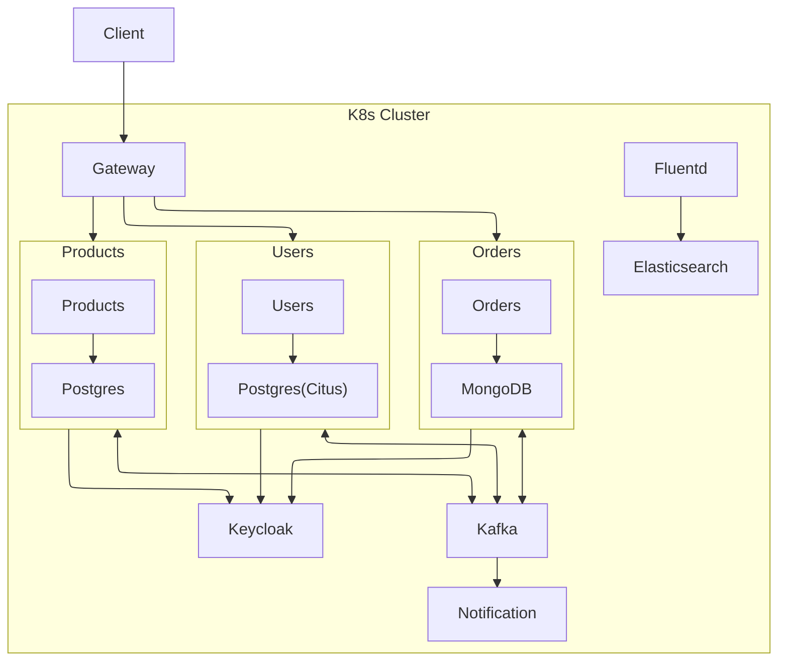

# Powerful Microservices

This project implements a scalable microservices-based system using modern methodologies, built with **FastAPI**, **Django(DRF)**, **Kafka**, **Keycloak**, **Kubernetes**, **Fluentd** and etc.
The project demonstrates modern distributed system patterns such as **Saga (Choreography), Event Sourcing, Eventual Consistency, DB Sharding**, and **centralized authentication**.

---

## High‑Level Overview

This platform is designed as a **loosely coupled, event‑driven architecture** suitable for scalable e‑commerce or transactional systems.

**Core goals:**

* Horizontal scalability
* Fault isolation
* Event‑driven communication
* Centralized authentication and logging
* Sharded databases and caching for efficiency.
* Cloud‑native deployment using Kubernetes
* Integrated pipelines for automated testing, building, and deployment (CI/CD)

---

## System Components

#### 1. API Gateway (FastAPI)

**Responsibilities:**

* Single entry point for clients
* JWT validation via **Keycloak**
* Rate limiting
* CORS configuration
* Request routing to internal services

> No business logic is implemented at the gateway level.

---

#### 2. Users Service

**Technology:** Django(DRF)
**Database:** PostgreSQL + **Citus (Sharded)**

**Responsibilities:**

* User management
* OTP‑based authentication flows
* User profile management
* Publishing user‑related domain events

**Features:**

* OTP caching via Redis
* Database sharding for horizontal scalability

---

#### 3. Products Service

**Technology:** FastAPI
**Database:** PostgreSQL

**Responsibilities:**

* Product catalog management
* Product pricing and availability

**Features:**

* Hot‑cache for frequently accessed products via Redis (TTL: 5 minutes)
* Event emission on product updates

---

#### 4. Orders Service

**Technology:** FastAPI
**Database:** MongoDB

**Responsibilities:**

* Order creation and lifecycle management
* Order state transitions

**Features:**

* Saga participant (Choreography‑based)
* Event sourcing for order state changes

---

#### 5. Notification Service

**Technology:** Celery
**Access:** Internal only (not publicly exposed)

**Responsibilities:**

* Email / SMS / async notifications
* Consumes Kafka events

**Features:**

* Background task execution via Celery
* Redis as broker/result backend

---

## Supporting Infrastructure

- **Kafka**: Provides event streaming and inter-service communication for publishing/subscribing to events (e.g., order created, product updated).
- **Keycloak**: Open-source identity and access management for authentication, token issuance, and validation.
- **Fluentd & Elasticsearch (ES)**: Logging aggregation (Fluentd) and storage/search (ES) for monitoring and debugging.
- **Redis**: In-memory data store for caching across services.
- **Kubernetes (K8s)**: Container orchestration platform for deploying, scaling, and managing all components in a cluster.

---

## System WorkFlow & Visual Schema

Below is a diagram representing the high-level architecture:


---

## Project Structure

```
.
├── README.md                     
├── docs/                         # project docs
└── src/
    ├── docker-compose.yml        # running the entire system locally with Docker
    ├── fluentd/                  # fluentd configs for log collection
    ├── gateway/                  # api gateway(fastapi app)
    ├── keycloak/                 # keycloak service(identity & access management)
    ├── k8s/                      # k8s manifests
    └── services/                 # core services
        ├── users/                
        ├── products/             
        ├── orders/               
        └── notifications/        

```

---

## Kubernetes Deployment

**Used Kubernetes resources:**

* Deployments
* StatefulSets
* Services
* ConfigMaps & Secrets
* Ingress

Each service is deployed independently and can scale horizontally.

---

## References

#### Kubernetes Deployment

This project can be deployed and tested locally using **Minikube** and Kubernetes manifests.

For detailed instructions including:
- Building service images
- Starting Minikube
- Loading images into Minikube
- Applying Kubernetes YAML files in the correct order

Refer to: [Kubernetes Deployment](docs/kubernetes.md)

This document explains the full Kubernetes execution flow step by step.

---

#### Keycloak Configuration

Authentication and authorization are handled using **Keycloak**.

The following topics are covered in detail:
- Creating a Realm
- Creating and configuring a Client
- Enabling Direct Access Grants
- Setting token lifetimes
- Creating users and roles
- Configuring environment variables for the users service

Refer to: [Keycloak](docs/keycloak.md)

This document provides a complete step-by-step guide for configuring Keycloak for this project.

---

## Future Improvements

* Distributed tracing (Jaeger / OpenTelemetry)
* Service mesh
* Dead‑letter queues

---

## License
MIT License